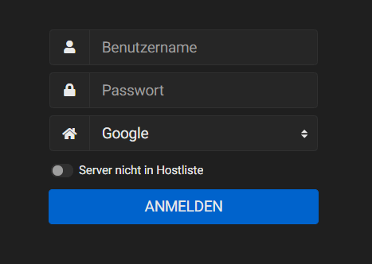

# Roundcube Otherserver Plugin

Roundcube offers the option to display a input field to enter a custom host. The Otherserver plugin is a companion plugin for the hostmatch plugin. The entered format for the host should match the [roundcube configuration definition](https://github.com/roundcube/roundcubemail/wiki/Configuration#imap-server-connection).

This plugin just adds a litte javascript code to the Roundcube login page and it is optimized for use with the Elastic skin, which was introduced in Roundcube 1.4.0.  
It *might* work with previous versions, but do not expect it to. You should use the legacy plugins for older Roundcube versions.

## Preview

## Links

[https://www.lostping.de](https://www.lostping.de)

[https://github.com/lostping/otherserver](https://github.com/lostping/otherserver)
  
## Kudos

This plugin is an overhaul of the plugins from **neurodeamon** as he doesn't continue to update them.

[https://github.com/neurodeamon/TinyHelpers-RoundcubePlugins](https://github.com/neurodeamon/TinyHelpers-RoundcubePlugins)